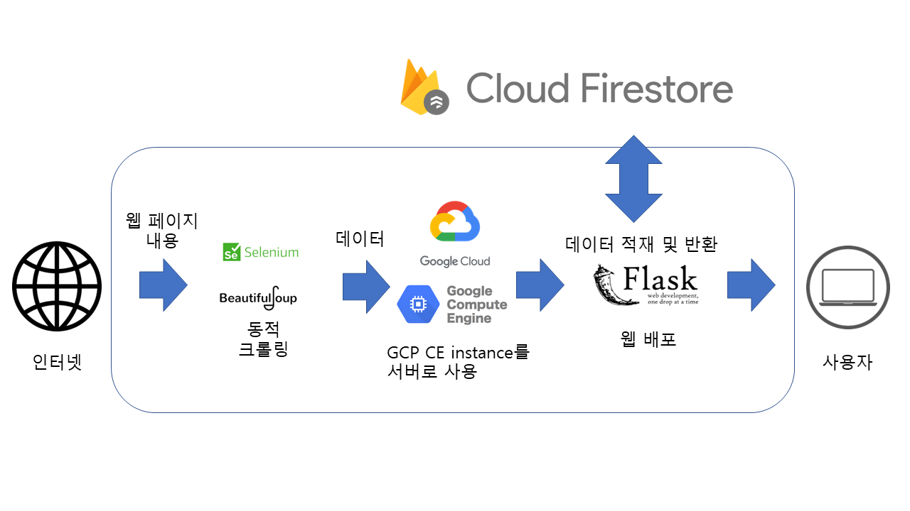

# 코드스테이츠 CP1

코드스테이츠 AIB 커리어 프로젝트 1; DE - 프로젝트 입니다.

## Overview

- 구인 사이트에서 기업 데이터를 수집하여 배포하는 API입니다.
- ML용 데이터 수집이 목표입니다.
## Roadmap

- 주기적으로 구인 사이트([원티드](https://www.wanted.co.kr/) 등)에서 데이터 관련 직군의 구인 공고에서 요구 기술 스택 등을 스크래핑.
- 취합한 데이터 정제 후 Google Cloud Platform Firestore Database에 쓰기, 읽기.
- flask app을 통해 GCP 인스턴스를 서버로 HTTP request에 따라 GCP firestore에서 데이터 로드 후 배포.

## HowToUse

- http://35.188.133.249/?name=%Y-%m-%d 형식으로 접근하여 해당 날짜의 최신 구인 데이터 json 형식으로 배포.
- http://35.188.133.249/update 에서 DB 업데이트(Cloud Scheduler에 의한 자동갱신 : 매 주 월요일 7시 30분)

## FlowChart

- GCP CE(Compute Engine) 인스턴스(debian/Linux) 위에서 flask app을 배포하는 서버가 작동한다.
- 인터넷에서 동적 스크롤링으로 기능하는 웹 페이지에서 selenium과 beautifulsoup를 통하여 원하는 데이터를 추출한다.
- 데이터는 python dictionary 형식으로 변환하여 Firestore에 저장된다.
- flask 웹 앱에서 주소에 포함한 인자로써 요청한 일자의 데이터를 Firestore로부터 받아와 게시한다.